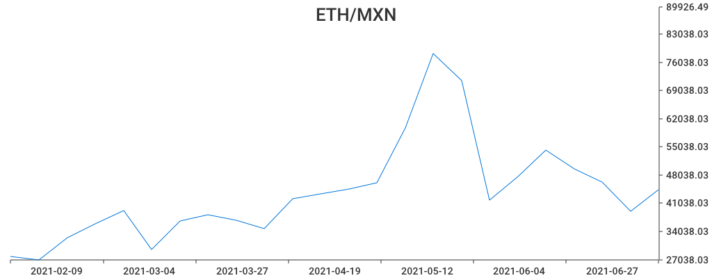

# Ed Team challenge with Go

Graficador del precio del Bitcoin con Go. Este servicio consume la API de [nomics](https://nomics.com) y sirve una API para poder solicitar un gráfico. 

El servicio recive:

* Siglas de la criptomoneda (BTC, ETH, etc)
* Fecha desde cuándo se quiere el informe.

El resultado de la API es un archivo PNG que contiene la gráfica del histórico de precios de la criptomoneda solicitada.

## Setup y ejemplo:
- Agregar variable de entorno api key con este nombre de variable `NOMICS_KEY`
```
export NOMICS_KEY="<tu_key>"
```

- Ejecutar `go get` y `go run main.go`

- Hacer una solicitud get para obtener el precio de ethereum en pesos mexicanos
```
curl -X 'GET' "http://localhost:8080/api/v1/nomics/chart?id=ETH&start=20210112&end=20211220&convert=MXN" --output chart.png
```

- Resultado



## Ejecutar tests
```
go test ./...
```
## Swagger editor
Documentación de swagger, copiar y pegar del archivo `openapi.yml` [aqui](https://editor.swagger.io/)
